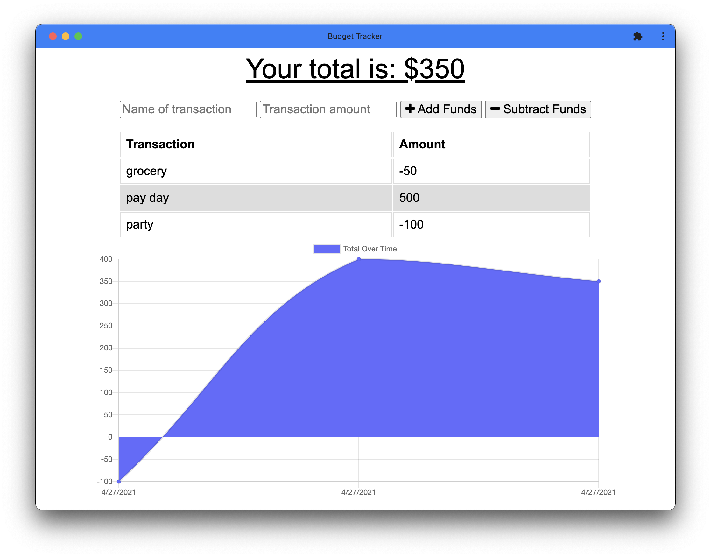
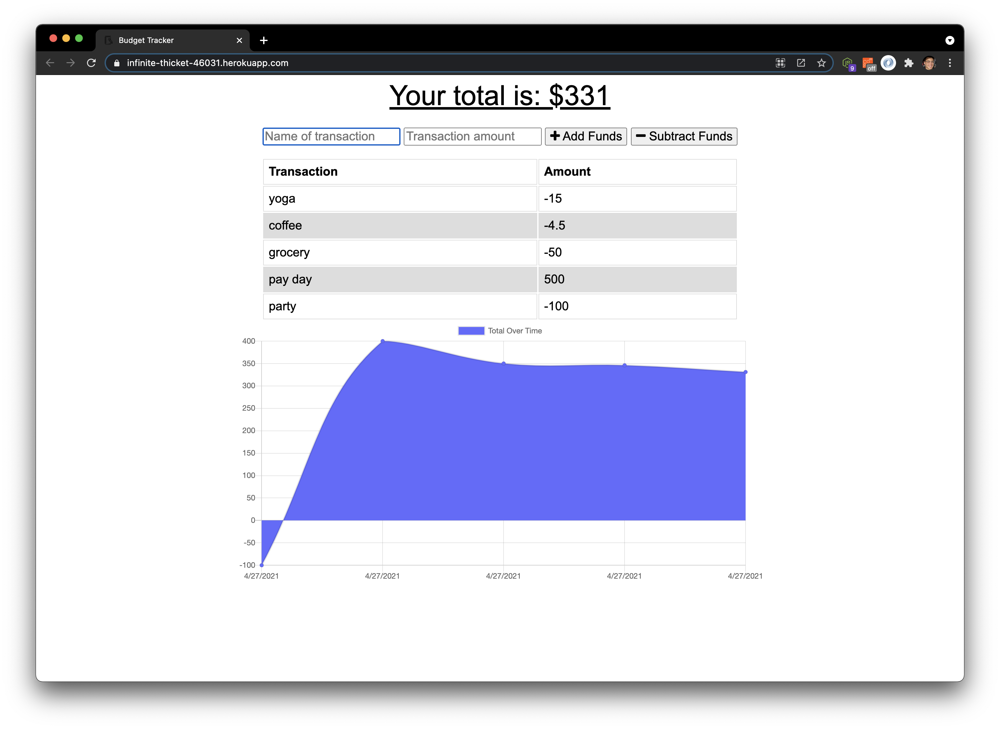

# Basic Budget Tracker
## Description
Basic deposit/expense tracker for budget management, designed using progressive web application technologies. This application provides the user with a simply way to track their everyday expenses and earnings with or without a connection. 

## Table of Contents
- [Description](#Description)
- [Deployment](#Deployment)
- [Features](#Features)
- [Credits](#Credits)
- [Contributing](#Contributing)
- [License](#License)
  

## Deployment
- [Heroku Deployment](https://infinite-thicket-46031.herokuapp.com/)
- [GitHub Repo](https://github.com/jareddeuriarte/budget-tracker)
  

  

### Features
- Node.js technology
- Express
- MongoDB & Mongoose framework
- progressive web application
- online & offline functionality

### Credits  
My tutor Namita.

### Contributing
Forks are welcome!

### License 
This project is licensed under MIT.

### Badges

### Questions?
Reach me at:
- [GitHub](https://github.com/jareddeuriarte)
- deuriartejared@gmail.com

